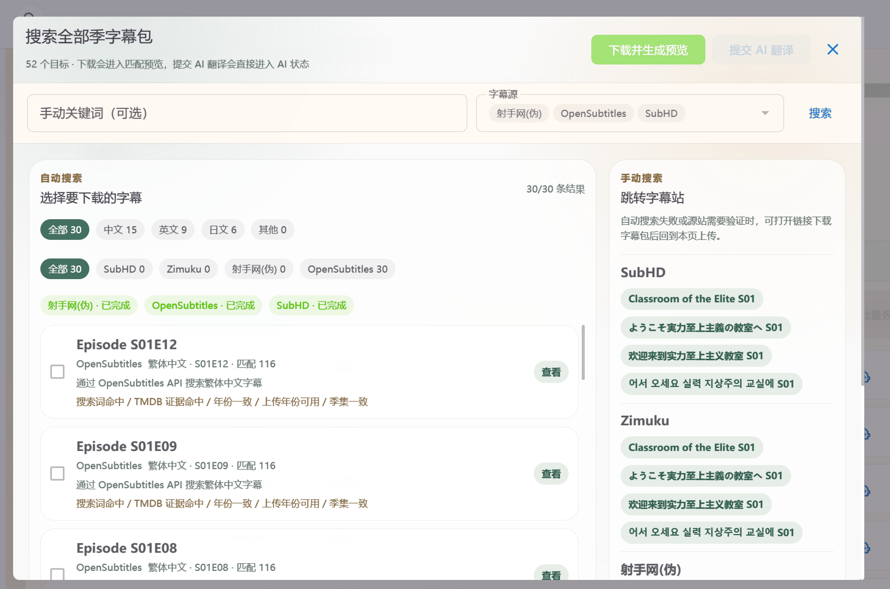

# MoviePilot-Plugins

面向 MoviePilot V2 的个人插件仓库，目前主要维护字幕匹配、AI 字幕生成和 Emby 媒体库封面生成。

## 展示图




## 开发初衷

这个仓库主要想把 MoviePilot 里的字幕处理做成一条顺手的链路：本地媒体库、在线字幕、手动上传、智能匹配、调轴、AI 翻译都能接起来。
它不是 ChineseSubFinder 的复刻，而是在 MoviePilot 插件体系里延续“少折腾文件，多专注观影”的使用体验。

## 插件列表

| 插件 | 目录 | 版本 | 主要功能 |
| --- | --- | --- | --- |
| 字幕匹配 | `plugins.v2/subtitlemanualupload` | 0.1.67 | 字幕搜索、下载、上传、匹配、改名、调轴、入库自动处理 |
| AI字幕生成(联动版) | `plugins.v2/autosubv3` | 3.5.54 | 音轨识别、字幕提取、AI 翻译、任务队列、联动字幕匹配 |
| Emby媒体库封面生成 | `plugins.v2/mediacovergenerator` | 0.9.10 | 生成 Emby/Jellyfin 媒体库静态或动态封面 |

## 字幕匹配

从 MoviePilot 本地整理记录中选择电影或剧集，完成字幕上传、在线搜索、批量匹配和落盘改名。

主要功能：

- 支持电影、单集、整季维度的字幕匹配。
- 支持 `.srt`、`.ass`、`.ssa`、`.sbv`、`.sub`、`.vtt`、`.webvtt`。
- 支持 ZIP/RAR 字幕包解析。
- 支持 SubHD、Zimuku、ASSRT、OpenSubtitles 等在线字幕来源。
- 支持语言和格式偏好，自动选择合适字幕入库。
- 支持繁体转简体、智能调轴、匹配历史管理。
- 支持入库后自动搜索字幕。
- 可联动 AI字幕生成(联动版)，把英文或外语字幕提交翻译。

## AI字幕生成(联动版)

用于从音轨、内嵌字幕或外挂字幕生成中文字幕，也可以接收“字幕匹配”提交的在线英文字幕。

主要功能：

- 支持 faster-whisper 语音识别。
- 支持优先使用外挂字幕或内嵌字幕。
- 支持 OpenAI 兼容接口翻译。
- 支持双语字幕或纯中文字幕输出。
- 支持批量任务、任务状态查看、取消和重新生成。
- 支持与“字幕匹配”互相联动。

## Emby媒体库封面生成

用于给 Emby/Jellyfin 媒体库生成统一风格的入口封面。

主要功能：

- 支持静态封面和动态封面。
- 支持多种封面风格、字体、分辨率和颜色策略。
- 支持从媒体库海报/背景图提取视觉元素。
- 支持媒体数量角标。
- 支持历史封面保存，方便回滚或复用。

## 安装方式

在 MoviePilot 第三方插件仓库中添加本仓库地址：

```text
https://github.com/ifsherlock/MoviePilot-Plugins
```

如只测试字幕链路，建议同时安装：

- 字幕匹配
- AI字幕生成(联动版)

## 注意事项

- 字幕站点和 API 可能变化，在线下载不能保证所有来源始终可用。
- RAR 解压依赖容器内或宿主机可用的解压工具。
- 智能调轴依赖 `ffmpeg`、`ffprobe`、`numpy`、`pysubs2` 等环境能力。
- AI 翻译质量取决于模型、提示词和原字幕质量。

## 致谢

本仓库基于 MoviePilot 插件机制开发，README 排版参考 [KoWming/MoviePilot-Plugins](https://github.com/KoWming/MoviePilot-Plugins)。

参考项目和源代码：

- [MoviePilot](https://github.com/jxxghp/MoviePilot)
- [MoviePilot-Plugins](https://github.com/jxxghp/MoviePilot-Plugins)
- [ChineseSubFinder](https://github.com/ChineseSubFinder/ChineseSubFinder)
- [allanpk716/chinesesubfinder](https://github.com/allanpk716/chinesesubfinder)
- [HappyQuQu/jellyfin-library-poster](https://github.com/HappyQuQu/jellyfin-library-poster)

主要依赖库：

- `faster-whisper`
- `openai`
- `httpx`
- `watchdog`
- `pillow`
- `pysubs2`
- `rarfile`
- `webrtcvad-wheels`
- `numpy`
