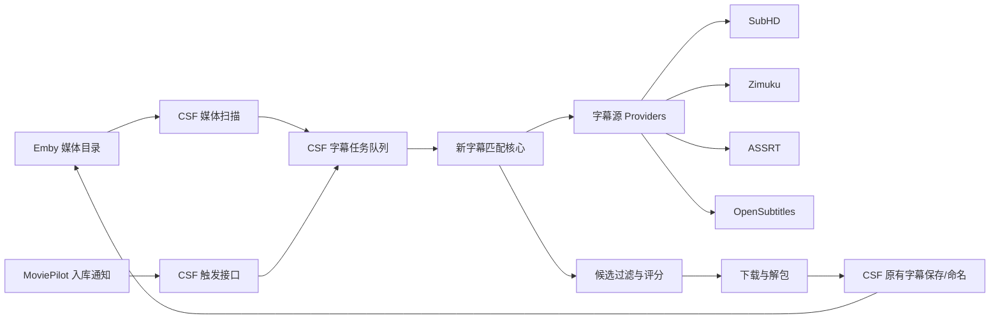

# ChineseSubFinder 字幕匹配核心迁移开发方案

## 背景

当前 MoviePilot 字幕匹配插件已经沉淀了较完整的在线字幕搜索、候选过滤、字幕优先级和入库命名能力，但它的职责更适合做 MoviePilot 内的手动补字幕入口。

ChineseSubFinder 本身才是长期运行的字幕服务，直接对接 Emby/Jellyfin/Plex 的媒体目录，负责批量扫描、后台任务、字幕下载和保存。MoviePilot 已有“入库通知 CSF 下载字幕”的插件能力，但 CSF 实际字幕匹配后端能力老化或不可用时，MP 侧再怎么联动也无法解决核心搜索质量问题。

因此本项目不再围绕 CD2/WebDAV 网盘挂载场景继续扩展 MoviePilot 插件，而是立项将 MoviePilot 字幕匹配插件中成熟的“搜索与匹配核心”迁移回 ChineseSubFinder，用于替换或增强 CSF 现有坏掉的后端匹配链路。

## 目标

1. 将 MoviePilot 字幕匹配插件中的在线字幕搜索能力迁移到 ChineseSubFinder。
2. 替换 CSF 中失效、质量差或不可维护的字幕匹配后端。
3. 保留 CSF 独立服务定位，直接面向 Emby 媒体目录工作，不依赖 MoviePilot。
4. 复用 CSF 原有媒体扫描、任务队列、字幕保存、Web UI 和通知能力。
5. 让 MoviePilot 只负责入库通知或手动触发，字幕搜索下载主链路由 CSF 承担。

## 非目标

1. 不把 MoviePilot 字幕插件改造成网盘媒体库扫描器。
2. 不要求 CSF 依赖 MoviePilot 的数据库、整理历史或插件 API。
3. 不在第一阶段重写 CSF 全部任务系统和前端。
4. 不承诺专门适配 CD2 挂载的全量文件探测能力。
5. 不把 ASR、AI 翻译、调轴作为第一阶段主目标。

## 核心原则

- CSF 是字幕后端服务，负责批量自动化。
- MoviePilot 插件是入口和辅助工具，负责入库通知、手动补字幕和 MoviePilot 生态体验。
- 搜索匹配能力应尽量抽象为独立模块，避免绑定 MoviePilot 或 CSF 任意一方。
- 媒体文件扫描、任务调度、字幕落盘优先复用 CSF 现有能力。
- 匹配失败要有明确原因和日志，不用静默兜底掩盖错配。

## 现有能力迁移范围

### 在线字幕源

优先迁移 MoviePilot 字幕匹配插件中已经接入并验证过的字幕源：

- SubHD
- Zimuku
- ASSRT
- OpenSubtitles

每个字幕源应统一为 provider 接口，输出标准化候选结果，避免后续匹配逻辑被源站差异污染。

### 匹配能力

需要迁移或重写为 CSF 可用的核心能力：

- 标题匹配：中文名、英文名、别名、原始文件名。
- 年份匹配：电影年份、剧集首播年份。
- 季集匹配：SxxExx、纯集数、整季包、双集/多集资源。
- 外部 ID 匹配：TMDB ID、IMDB ID，如 CSF 当前模型可提供则优先使用。
- 源站标题过滤：避免字幕源返回同名不同年份、不同剧集、不同版本资源。
- 上传年份过滤：降低旧片/重名片错配概率。
- 语言优先级：双语 > 简中 > 繁中 > 英文。
- 格式优先级：ASS > SRT > SSA > VTT。
- 字幕包处理：压缩包解压、候选字幕文件挑选、无效包过滤。

### 候选评分

建议形成统一评分模型：

| 维度 | 说明 |
| --- | --- |
| 标题相似度 | 文件标题、媒体标题、别名与字幕标题的相似度 |
| 年份一致性 | 电影年份或剧集年份是否一致 |
| 季集一致性 | 搜索目标集数与字幕候选集数是否一致 |
| ID 一致性 | TMDB/IMDB 命中时显著加权 |
| 语言优先级 | 双语、简中、繁中、英文按偏好排序 |
| 格式优先级 | ASS/SRT/SSA/VTT 按偏好排序 |
| 版本关键词 | WEB-DL、BluRay、REMUX、NF、AMZN 等关键词可作为弱信号 |
| 排除项 | CAM、TC、错误季集、错误年份、明显不相干标题直接淘汰 |

评分结果必须保留可解释字段，便于日志和 UI 展示“为什么选它/为什么过滤它”。

## 建议架构



## 模块设计

| 模块 | 职责 | 备注 |
| --- | --- | --- |
| MediaContext | 把 CSF 媒体信息转换为搜索上下文 | 包含标题、年份、季集、ID、文件路径 |
| ProviderAdapter | 统一字幕源搜索和下载接口 | 每个站点一个实现 |
| SearchPlanner | 生成多组搜索关键词 | 例如中文名、英文名、原名、年份组合 |
| CandidateNormalizer | 标准化源站候选 | 统一标题、语言、格式、下载链接、发布时间 |
| MatchFilter | 硬过滤错配结果 | 年份、季集、标题、ID |
| MatchScorer | 给候选字幕打分排序 | 保留 explain 字段 |
| ArchiveSelector | 从压缩包中挑字幕文件 | 按语言/格式/集数优先级 |
| CSFBridge | 接入 CSF 任务、下载、保存链路 | 尽量薄，不塞业务规则 |

## 接口草案

### 搜索上下文

```go
type MediaSearchContext struct {
    MediaType      string
    Title          string
    OriginalTitle  string
    Aliases        []string
    Year           int
    Season         int
    Episode        int
    TMDBID         string
    IMDBID         string
    VideoPath      string
    ReleaseGroup   string
    SourceKeywords []string
}
```

### 字幕候选

```go
type SubtitleCandidate struct {
    Provider     string
    Title        string
    Language     string
    Format       string
    DownloadURL  string
    PageURL      string
    Season       int
    Episode      int
    Year         int
    Score        float64
    Reasons      []string
    Raw          any
}
```

### Provider 接口

```go
type SubtitleProvider interface {
    Name() string
    Search(ctx context.Context, query MediaSearchContext) ([]SubtitleCandidate, error)
    Download(ctx context.Context, candidate SubtitleCandidate) (*DownloadedSubtitle, error)
}
```

## 实现阶段

### 第一阶段：CSF 现状审计

目标是确认 CSF 当前坏在什么位置，不直接开写。

- 梳理 CSF 当前媒体扫描、字幕任务、搜索 provider、下载保存链路。
- 找出当前后端匹配失败原因：源站失效、解析失效、评分弱、任务入口坏、还是保存链路坏。
- 标记可以复用的 CSF 模块和必须替换的模块。
- 输出最小替换点。

交付物：

- CSF 字幕链路调用图。
- 现有 provider 可用性清单。
- 新匹配核心接入点说明。

### 第二阶段：抽取 MoviePilot 匹配核心

目标是把 MoviePilot 字幕匹配插件里的有效规则迁移为可复用逻辑。

- 抽出 provider 搜索逻辑。
- 抽出候选标准化逻辑。
- 抽出标题、年份、季集、ID 的过滤规则。
- 抽出语言/格式优先级。
- 补充可解释评分原因。

交付物：

- 可独立测试的匹配核心模块。
- Provider 单元测试或最小集成测试。
- 典型电影/剧集样本测试集。

### 第三阶段：接入 CSF 后端

目标是让 CSF 使用新匹配核心完成一次完整字幕下载。

- 在 CSF 原有任务队列中调用新匹配核心。
- 将 CSF 媒体信息映射为 `MediaSearchContext`。
- 候选结果回填 CSF 日志和任务状态。
- 下载后的字幕交给 CSF 原有保存/命名逻辑。

交付物：

- 单电影自动搜索下载成功。
- 单集剧集自动搜索下载成功。
- 整季资源至少不误匹配。

### 第四阶段：稳定性与配置

目标是让新链路可长期运行。

- 增加 provider 开关。
- 增加搜索超时、重试、并发限制。
- 增加候选日志和失败原因。
- 增加语言/格式偏好配置。
- 增加源站不可用降级策略。

交付物：

- 可配置的字幕源列表。
- 后台任务不会因单个源站失败而整体失败。
- 日志能定位错配、无结果、下载失败、解包失败。

### 第五阶段：MoviePilot 通知联动验证

目标是确认 MP 入库通知 CSF 的插件仍能触发新链路。

- MoviePilot 入库后通知 CSF。
- CSF 根据 Emby/媒体目录中的真实文件独立搜索字幕。
- 验证 MP 不需要传递 MoviePilot 整理历史细节。

交付物：

- MP 入库通知触发 CSF 下载字幕的实测记录。
- CSF 独立手动触发下载的实测记录。

## 测试样本建议

| 类型 | 样本 | 重点 |
| --- | --- | --- |
| 中文电影 | 中文名和英文名差异大的电影 | 标题别名匹配 |
| 重名电影 | 同名不同年份电影 | 年份过滤 |
| 美剧单集 | S01E01 | 季集匹配 |
| 多集资源 | S01E01E02 | 多集识别 |
| 整季资源 | Season 1 Pack | 整季包处理 |
| 动画 | 命名不规则番剧 | 标题和集数容错 |
| 字幕包 | zip/rar 内多个字幕 | 文件挑选 |
| 错配源站结果 | 同名不同剧 | 硬过滤和解释日志 |

## 风险与取舍

| 风险 | 处理方式 |
| --- | --- |
| CSF 是 Go 项目，MoviePilot 插件是 Python | 迁移规则和算法，不强行复用代码文件 |
| 部分字幕源依赖反爬或验证码 | 第一阶段只迁移稳定可自动化的能力，验证码源降级处理 |
| 评分规则过严导致无结果 | 区分硬过滤和软评分，日志保留过滤原因 |
| 评分规则过松导致错配 | 年份、季集、ID 作为硬边界 |
| 网盘挂载路径读取慢 | 由 CSF 任务队列和媒体扫描策略处理，不在 MP 插件中扩展 |
| MP 通知信息不足 | CSF 仍以 Emby/媒体目录为事实来源，MP 只触发任务 |

## 验收标准

1. CSF 不依赖 MoviePilot，也能对 Emby 媒体目录中的资源搜索字幕。
2. 至少 SubHD、Zimuku、ASSRT、OpenSubtitles 中可用源能接入统一 provider。
3. 电影、单集剧集、整季资源都有基础测试样本。
4. 候选字幕排序符合语言和格式优先级。
5. 错配结果能被过滤，并在日志中说明原因。
6. 单个字幕源失败不会导致整次任务失败。
7. MoviePilot 入库通知 CSF 后，新链路能被触发。

## 推荐推进顺序

1. 先审计 ChineseSubFinder 当前字幕搜索链路。
2. 再列出 MoviePilot 字幕插件中可以迁移的 provider 和匹配规则。
3. 先做单资源手动触发搜索，不碰全量自动任务。
4. 单资源稳定后接入 CSF 任务队列。
5. 最后验证 MoviePilot 入库通知插件到 CSF 的完整链路。
