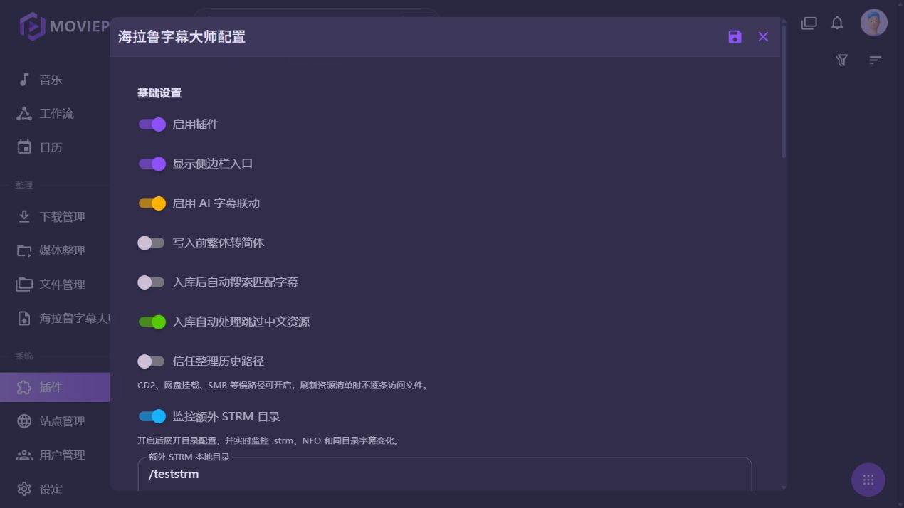
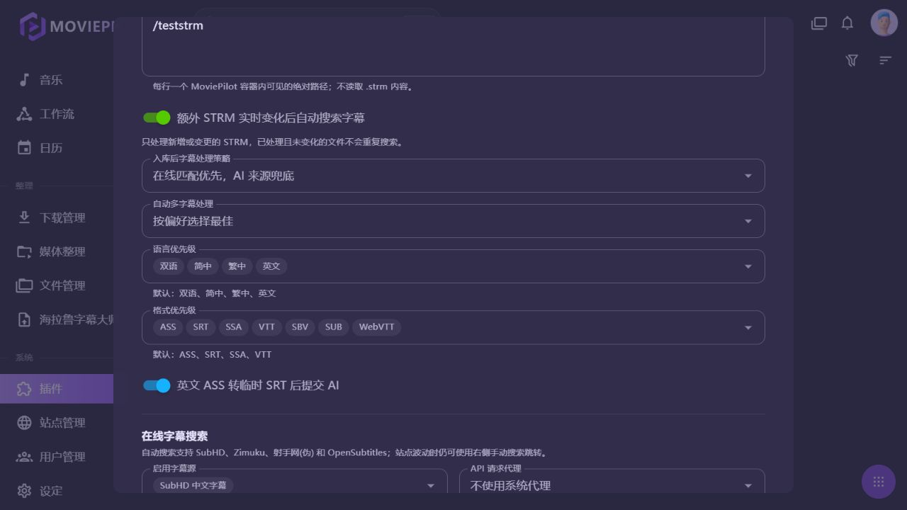
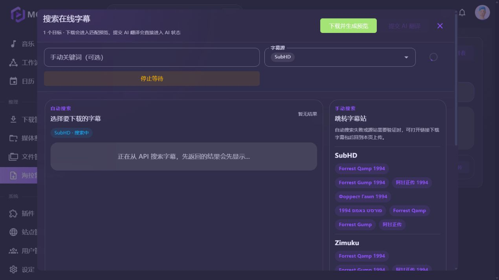
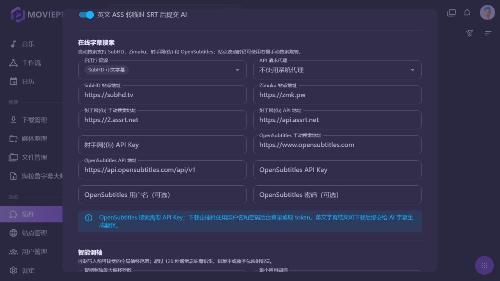
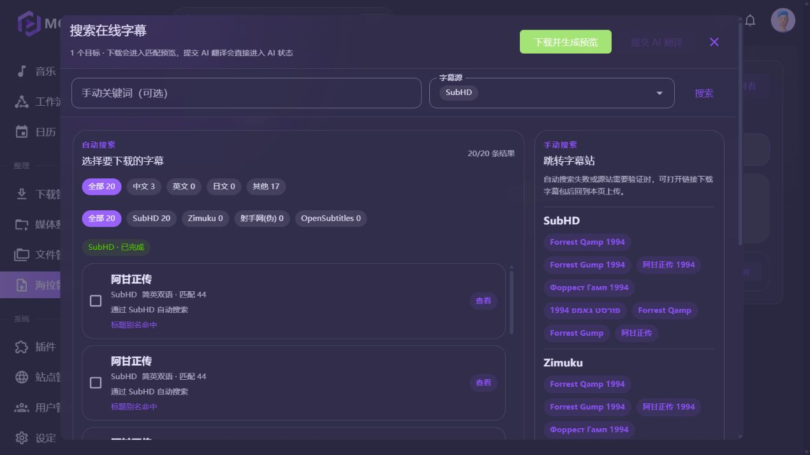
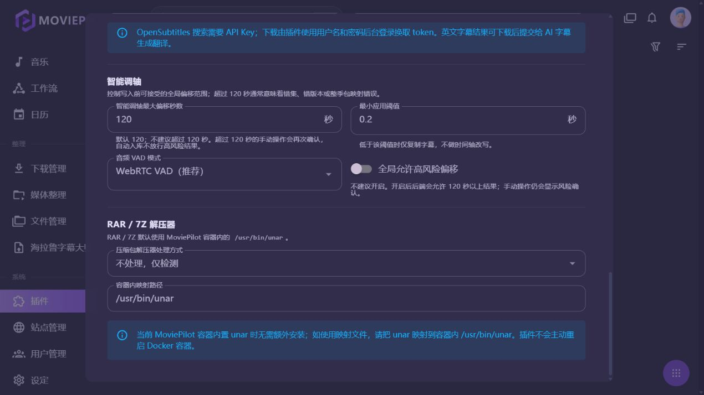

# 海拉鲁字幕大师功能使用教学

本文适用于：

- MoviePilot V2 + 海拉鲁字幕大师 `0.1.90`
- MoviePilot V3 + 海拉鲁字幕大师 `1.2.6`

V2 和 V3 的页面功能基本一致。主要差异是插件内部使用的 MoviePilot 接口不同，用户配置、操作方式和字幕文件命名规则保持一致。

## 一、安装插件

### 1. 从插件市场安装

1. 进入 MoviePilot 左侧的“插件”。
2. 打开“插件市场”。
3. 搜索“海拉鲁字幕大师”。
4. V2 选择 `0.1.90`，V3 选择 `1.2.6`。
5. 点击安装，等待依赖安装完成。
6. 安装完成后，在“我的插件”中确认状态为“运行中”。

V3 测试页中显示的插件版本如下：


### 2. 启用插件

在插件卡片菜单中点击“设置”，打开“启用插件”。保存后，左侧会出现“海拉鲁字幕大师”入口。

如果没有看到入口：

- 确认“显示侧边栏入口”已打开；
- 刷新 MoviePilot 页面；
- 检查插件日志中是否有“加载插件：SubtitleManualUpload”。

## 二、基础配置

打开“海拉鲁字幕大师 -> 插件设置”，基础设置区域包含以下开关。



### 启用插件

总开关。关闭后插件页面、索引和自动处理均停止工作。

### 显示侧边栏入口

控制 MoviePilot 左侧是否显示“海拉鲁字幕大师”。关闭不会卸载插件，只会隐藏入口。

### 启用 AI 字幕联动

允许插件把英文字幕等任务提交给“AI字幕生成(联动版)”。这不会自动启用 AI 插件；AI 插件未安装或未启用时，页面会显示不可用原因。

### 写入前繁体转简体

写入字幕前，把中文字幕转换为简体。只影响写入文件，不修改在线字幕源和上传原文件。

### 入库后自动搜索匹配字幕

监听 MoviePilot 的正常“整理完成”事件。适用于 MoviePilot 自己产生的入库事件。

额外 STRM 不会产生整理完成事件，因此额外 STRM 应使用下面单独的实时监控和自动搜索设置。

### 入库自动处理跳过中文资源

开启后，插件会根据 TMDB 语言、国家/地区和 MoviePilot 分类判断中文资源。判断为中文资源时，自动字幕队列跳过，避免给已经是中文字幕的资源重复搜索。

### 信任整理历史路径

用于 CD2、SMB、WebDAV、网盘挂载等慢路径。开启后，读取 MoviePilot 整理历史时不逐个检查视频文件是否可访问。

这个开关只影响“信任整理历史路径”的视频目标，不会隐藏同目录外挂字幕。外挂字幕仍然通过目录扫描读取。

## 三、额外 STRM 目录配置

### 1. 开关和路径

打开“监控额外 STRM 目录”后，路径和自动搜索配置会展开。这个开关本身就会启动实时监控，不需要再打开第二个监控开关。



路径必须填写 MoviePilot 容器内可见的绝对路径，每行一个目录。例如：

```text
/teststrm
/media/strm-library
```

宿主机路径和容器路径不是一回事。假设 Compose 中这样挂载：

```yaml
volumes:
  - /vol2/1000/raid/2/teststrm:/teststrm
```

插件里必须填写 `/teststrm`，不能填写宿主机的 `/vol2/1000/raid/2/teststrm`。

### 2. 推荐目录结构

电影：

```text
/teststrm/
└── 阿甘正传 (1994)/
    └── 阿甘正传 (1994) - 1080p.strm
```

电视剧：

```text
/teststrm/
└── 示例剧集 (2024)/
    └── Season 1/
        ├── S01E01.strm
        └── S01E02.strm
```

不要把所有 `.strm` 文件直接堆在 `/teststrm` 根目录下。目录名是无 NFO 时的重要识别依据。

### 3. 实时监控行为

开关打开并保存后，插件会：

- 首次启动做一次全量基线扫描；
- 监控新增、修改、删除和移动的 `.strm`；
- 监控同目录字幕和 NFO 变化；
- 只重新处理受影响的文件或目录；
- 对字幕变化只刷新对应目录的字幕缓存；
- 对重复文件事件做防抖；
- 监控库不可用时回退到轻量轮询；
- 插件停止或重新保存配置时停止旧监控线程。

状态接口会显示：

```text
enabled=true
running=true
roots=[/teststrm]
last_error=
```

新增 STRM 后不需要点击“刷新媒体库清单”，等待几秒即可在插件搜索中出现；删除 STRM 后也会从插件索引中移除。

## 四、媒体识别和封面补全

### 1. 有 NFO 或 ID 标签时

优先使用 NFO、路径标签或 MoviePilot 已有身份。

支持的路径标签包括：

```text
{tmdbid=106449}
[tmdb-94664]
tmdb=13
doubanid=1295644
```

例如：

```text
/teststrm/无职转生 (2021) [tmdb-94664]/S01E01.strm
```

### 2. 没有媒体 ID 时

插件不会请求 STRM 内的远程地址，也不会读取远程视频。它只使用：

- 标题；
- 年份；
- 电影/电视剧类型；
- 季集信息。

然后复用 MoviePilot 自身的 `TmdbChain` 媒体匹配接口和缓存。匹配成功后补全：

- TMDB ID；
- 海报；
- 背景图；
- 原始标题和英文标题；
- 原始语言和国家/地区；
- 简介和评分。

匹配结果会缓存到插件本地索引，后续打开详情不会重复请求。目标文件 ID 仍然基于本地路径生成，因此补全媒体信息不会让当前选择的字幕目标失效。

### 3. 识别失败时

如果标题过于模糊、年份错误或多个结果无法区分，插件会保留标题+年份结果，不会强行取第一条错误媒体。此时可以：

- 在目录名中补充年份；
- 增加 `[tmdb-数字]` 标签；
- 添加 NFO；
- 在页面中使用在线字幕手动搜索。

## 五、首页资源搜索

进入“海拉鲁字幕大师”后，默认打开“字幕匹配”页。


页面顶部显示：

- 当前资源数量；
- 当前视频目标数量；
- 最后更新时间；
- 刷新媒体库清单按钮。

搜索框支持：

- 电影名；
- 剧名；
- 文件名关键词；
- 中英文标题。

类型筛选支持“全部、电影、电视剧”。点击媒体卡片进入目标详情。

V2 页面布局和操作相同，版本号显示为 `0.1.90`。

## 六、媒体详情和目标列表


媒体详情页会显示：

- 海报；
- 媒体名称和年份；
- 本地目标数量；
- 每个 STRM 或视频文件；
- 外挂字幕数量；
- 目标锁定状态。

电影通常只有一个目标。电视剧会显示季度卡片，可以切换“全部季”或单独季度。

每个目标右侧常用按钮包括：

- 查看外挂字幕；
- AI 字幕任务；
- 搜索在线字幕；
- 单集上传；
- 锁定目标。

STRM 目标会显示为可写入本地目标，但会跳过音频调轴和视频内嵌字幕探测。

## 七、手动上传字幕

### 1. 上传流程

1. 在媒体详情中勾选一个或多个目标。
2. 点击“批量上传整季字幕”或某一集的“单集上传”。
3. 选择 `.srt`、`.ass`、`.ssa`、`.vtt`、`.sub`、`.sbv` 或 `.webvtt`。
4. 也可以上传包含字幕的 `.zip`、`.rar`、`.7z`。
5. 插件解析字幕语言和季集号。
6. 检查预览中的目标映射和输出文件名。
7. 确认写入。

### 2. STRM 的字幕写入规则

STRM 不需要被播放或下载。插件只使用 STRM 文件的本地路径。

例如：

```text
视频：阿甘正传 (1994) - 1080p.strm
字幕：英文字幕.ass
写入：阿甘正传 (1994) - 1080p.chi.ass
```

写入位置是 STRM 所在目录。插件会：

1. 创建临时上传文件；
2. 根据语言后缀生成目标名；
3. 写入同目录；
4. 原子替换目标字幕；
5. 刷新该目录字幕缓存；
6. 更新匹配历史。

STRM 文件内容不会被改写。

如果同名字幕已经存在，插件会在覆盖前生成调轴备份文件；普通覆盖也会通过临时文件避免留下半个字幕文件。

## 八、在线字幕搜索



在线搜索弹窗可以：

- 使用自动关键词；
- 手动填写关键词；
- 选择字幕源；
- 查看右侧手动搜索链接；
- 下载并生成匹配预览；
- 对英文字幕提交 AI 翻译。

### 自动字幕源

当前自动源规则：

| 字幕源 | 是否需要 API Key | 适用方式 |
|---|---:|---|
| SubHD | 否 | 网页搜索、网页下载、验证码/风控失败后提示 |
| Zimuku | 否 | 网页搜索、网页下载、验证码失败后提示 |
| ASSRT | 是 | API 搜索和下载 |
| OpenSubtitles | 是 | API 搜索；下载还需要用户名和密码 |

SubHD、Zimuku 不需要 API Key。V2/V3 自动搜索默认启用这两个来源。



### 自动搜索结果



搜索结果会显示：

- 来源；
- 字幕语言；
- 字幕格式；
- 季集匹配情况；
- 身份匹配分数；
- 是否可下载。

插件不会把热门榜单或标题不匹配的候选当作正确字幕。

## 九、额外 STRM 自动搜索

这是额外 STRM 的完整自动链路：

```text
新增/修改 STRM
    ↓
实时监控捕获事件
    ↓
增量更新 STRM 索引
    ↓
MoviePilot 媒体匹配补全身份
    ↓
文件指纹去重
    ↓
进入自动字幕队列
    ↓
使用已启用在线字幕源搜索
    ↓
下载字幕并按 STRM basename 写回同目录
```

开启“额外 STRM 实时变化后自动搜索字幕”后：

- 只处理新增或发生变化的 STRM；
- 相同路径、大小、修改时间和媒体身份不会重复搜索；
- 重启 MoviePilot 后未变化文件不会重复搜索；
- STRM 强制使用 `online_source_only`；
- 不提交 AI 音频生成；
- 不执行智能调轴；
- 没有可用在线源时不创建无效任务，等配置好来源后再处理。

如果想只监控 STRM、不自动搜索字幕，只打开“监控额外 STRM 目录”，关闭“额外 STRM 实时变化后自动搜索字幕”。

## 十、智能调轴



### 普通视频

普通本地视频可以使用：

- 内嵌文本字幕作为基准；
- ffmpeg 抽取音频；
- WebRTC VAD；
- RMS 能量阈值降级模式。

### STRM

STRM 本地只有一个远程地址文本，插件无法可靠读取远程视频音频。因此 STRM 目标会明确跳过智能调轴，并在任务中显示“STRM 资源跳过智能调轴”。

这不是缺陷，而是为了避免对慢网盘或失效远程地址进行大文件读取。

## 十一、AI 字幕联动

AI 联动适用于普通可读取的视频文件或已下载的英文字幕。

STRM 可以搜索和写入在线字幕，但不会把 STRM 直接提交给 AI 音频识别。若需要 AI 翻译：

1. 先搜索并下载英文字幕；
2. 确认字幕已能匹配目标；
3. 使用在线字幕弹窗的 AI 翻译入口；
4. 等待 AI 任务完成；
5. 确认翻译结果后写回 STRM 同目录。

## 十二、匹配历史

点击顶部“匹配历史”查看已写入字幕。

历史按媒体、季度、集和字幕文件分层展示。历史记录包含：

- 字幕文件名；
- 写入目标；
- 来源；
- 写入时间；
- 调轴状态；
- 备份状态。

历史页面使用缓存快照。外部字幕变化由目录签名和实时监控触发更新，不会每次打开页面都全量扫描。

## 十三、锁定、删除和恢复

### 锁定目标

锁定后，批量上传、批量删除、批量调轴和自动处理都会跳过该目标。

### 删除外挂字幕

删除操作只删除与目标视频同目录、且匹配目标 basename 的字幕文件，不删除 STRM 文件本身。

### 恢复调轴备份

如果字幕经过智能调轴并生成备份，可以在匹配历史中恢复调轴前版本。

## 十四、RAR / 7Z 解压器


默认使用 MoviePilot 容器内的 `/usr/bin/unar`。

- `不处理，仅检测`：不自动安装，只使用已有解压器；
- `容器内安装`：插件加载时尝试安装；
- `映射文件`：使用 Compose 映射到容器内的 `unar`。

## 十五、常见问题

### 搜索不到额外 STRM

检查：

1. 插件中是否打开“监控额外 STRM 目录”；
2. 路径是否为容器内路径；
3. 容器内是否能执行 `find /teststrm -name '*.strm'`；
4. STRM 是否位于配置目录的子目录中；
5. 是否等待了几秒让实时索引更新。

### 没有封面

目录名最好包含年份。没有 NFO、TMDB 标签时，插件会调用 MoviePilot 媒体匹配；标题过于模糊时不会强行刮错封面。可以补充 `[tmdb-数字]` 标签解决。

### 自动搜索没有任务

检查“额外 STRM 实时变化后自动搜索字幕”是否打开。SubHD/Zimuku 不需要 API Key；ASSRT/OpenSubtitles 需要对应密钥。没有启用任何在线源时，插件不会创建无效队列任务。

### 自动搜索失败

打开“匹配历史”或“自动入库队列”查看真实原因。常见原因：

- 字幕站点验证码或风控；
- 站点暂时不可访问；
- 结果身份不匹配；
- 下载页面没有返回字幕地址；
- 目标 STRM 已被删除或移动。

### STRM 被识别但不能调轴

这是预期行为。STRM 不读取远程视频音频，智能调轴只对本地可读取视频提供支持。

## 十六、V2/V3 对照

| 功能 | V2 | V3 |
|---|---|---|
| 插件版本 | `0.1.90` | `1.2.6` |
| 额外 STRM 实时监控 | 支持 | 支持 |
| MoviePilot 媒体匹配封面 | 支持 | 支持 |
| SubHD/Zimuku 自动搜索 | 支持，无需 API Key | 支持，无需 API Key |
| ASSRT/OpenSubtitles | 需要对应 API 配置 | 需要对应 API 配置 |
| STRM 字幕写回 | 支持 | 支持 |
| STRM 智能调轴 | 跳过 | 跳过 |
| V3 统一媒体身份 | 不适用 | 支持 `media_source/media_id` |

## 十七、测试环境说明

本文中的截图来自独立测试实例，页面版本分别为 V2 `0.1.90` 和 V3 `1.2.6`。测试实例的登录地址、账号和密码不写入仓库；请使用你自己的 MoviePilot 管理员账号登录。

测试样例使用容器内路径 `/teststrm`。正式环境请根据自己的 Compose 挂载关系填写容器内路径。
